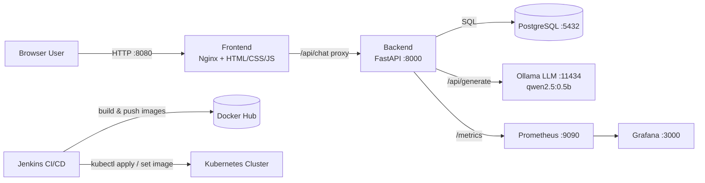

# 🤖 AI Chatbot + DevOps Pipeline

End-to-end project: **Frontend (Chat UI) → Backend (FastAPI) → Database (PostgreSQL) → Open-source AI Model (Ollama)**,
fully containerized with **Docker**, orchestrated with **Kubernetes**, automated with **Jenkins CI/CD**, and monitored with **Prometheus + Grafana**.

---

## 1. Architecture (kaise kaam karta hai)



**Flow in one line:** User browser → Frontend (chat UI) → Backend API → saves chat in Postgres + asks Ollama (open-source LLM) for a reply → returns reply to browser. Prometheus scrapes backend metrics, Grafana visualizes them. Jenkins builds, tests, and deploys everything to Kubernetes.

---

## 2. Folder Structure

```
ai-chatbot-devops/
├── backend/
│   ├── app/
│   │   ├── main.py          # FastAPI app (chat, health, metrics, history)
│   │   ├── database.py       # SQLAlchemy DB connection
│   │   ├── models.py         # ChatMessage table model
│   │   ├── schemas.py        # Pydantic request/response models
│   │   └── ollama_client.py  # Talks to the open-source LLM (Ollama)
│   ├── tests/
│   │   └── test_main.py
│   ├── requirements.txt
│   └── Dockerfile
├── frontend/
│   ├── index.html            # Chat UI (terminal-style theme)
│   ├── style.css
│   ├── script.js
│   ├── nginx.conf            # Reverse proxy to backend
│   └── Dockerfile
├── k8s/
│   ├── namespace.yaml
│   ├── configmap.yaml        # ConfigMap + Secret (env vars)
│   ├── postgres-deployment.yaml
│   ├── ollama-deployment.yaml
│   ├── deployment.yaml       # Backend Deployment + Service
│   ├── service.yaml          # Frontend Deployment + Service
│   ├── ingress.yaml
│   └── hpa.yaml               # Auto-scaling
├── jenkins/
│   └── Jenkinsfile
├── monitoring/
│   ├── prometheus-config.yaml
│   └── grafana-dashboard.json
├── docker-compose.yml        # local dev — everything in one command
├── .gitignore
└── README.md
```

---

## 3. PART A — Run Locally with Docker Compose (sabse pehle yeh karo)

### Step 1: Prerequisites
- Docker Desktop installed (Windows/Mac/Linux) — includes `docker compose`
- Git installed
- ~1 GB free disk space (for the small AI model)

### Step 2: Clone / open the project
```bash
cd ai-chatbot-devops
```

### Step 3: Start everything
```bash
docker compose up -d --build
```
This starts 6 containers: `postgres`, `ollama`, `backend`, `frontend`, `prometheus`, `grafana`.

### Step 4: Pull the open-source AI model (one-time, ~400 MB — fast!)
```bash
docker exec -it chatbot-ollama ollama pull qwen2.5:0.5b
```
This is a small model, so it downloads quickly and runs even on low-RAM machines (good for laptops/demos).

**Other lightweight options** (update `OLLAMA_MODEL` in `docker-compose.yml` if you switch):

| Model | Approx. size | Notes |
|---|---|---|
| `qwen2.5:0.5b` | ~400 MB | Default — good balance of speed & quality |
| `smollm2:360m` | ~725 MB | Slightly better replies, still fast |
| `smollm2:135m` | ~270 MB | Smallest, very basic replies |
| `tinyllama` | ~638 MB | Older but solid for short Q&A |
| `llama3.2:1b` | ~1.3 GB | Better quality if you have the bandwidth |

### Step 5: Check everything is healthy
```bash
docker compose ps
curl http://localhost:8000/health
```
Expected response:
```json
{"status":"ok","database":"ok","model_backend":"qwen2.5:0.5b"}
```

---

## 4. PART B — How It Looks in the Browser (DEMO)

Open these URLs after `docker compose up`:

| URL | What you see |
|---|---|
| **http://localhost:8080** | 🎯 Main Chat UI — terminal-style chat window on the left, "Pipeline Status" panel on right showing live status of Frontend/Backend/DB/AI Model |
| http://localhost:8000/docs | Swagger UI — interactive API docs (test `/api/chat`, `/api/history/{session_id}` directly) |
| http://localhost:8000/health | JSON health check (used by k8s probes) |
| http://localhost:8000/metrics | Raw Prometheus metrics |
| http://localhost:9090 | Prometheus UI — query `chatbot_requests_total` |
| http://localhost:3000 | Grafana (login: `admin` / `admin`) — import `monitoring/grafana-dashboard.json` |

### What the demo flow looks like:
1. Browser khulta hai → chat window dikhta hai (dark terminal theme)
2. Right sidebar mein green "ok" status pills dikhte hain — Frontend, Backend, DB, AI Model sab connected
3. User type karta hai "Hello, what can you do?" → Enter dabata hai
4. Message "you" bubble mein dikhta hai, "bot" bubble mein "thinking..." aata hai
5. Backend → Ollama se LLM response leta hai → Postgres mein save karta hai → response wapas bhejta hai
6. Bot ka reply chat window mein update ho jata hai
7. Refresh karne par bhi history `/api/history/{session_id}` se load ho sakti hai

---

## 5. PART C — Kubernetes Deployment (production setup)

### Step 1: Prerequisites
- A Kubernetes cluster (Minikube, Kind, or cloud — EKS/GKE/AKS)
- `kubectl` configured to point to your cluster
- NGINX Ingress Controller installed (for `ingress.yaml`)
- A Docker Hub account (to push your images)

### Step 2: Build & push images to Docker Hub
```bash
docker login

docker build -t <your-dockerhub-username>/ai-chatbot-backend:latest ./backend
docker push <your-dockerhub-username>/ai-chatbot-backend:latest

docker build -t <your-dockerhub-username>/ai-chatbot-frontend:latest ./frontend
docker push <your-dockerhub-username>/ai-chatbot-frontend:latest
```

### Step 3: Update image names in manifests
In `k8s/deployment.yaml` and `k8s/service.yaml`, replace:
```
<your-dockerhub-username>/ai-chatbot-backend:latest
<your-dockerhub-username>/ai-chatbot-frontend:latest
```
with your actual Docker Hub username.

### Step 4: Apply manifests in order
```bash
kubectl apply -f k8s/namespace.yaml
kubectl apply -f k8s/configmap.yaml
kubectl apply -f k8s/postgres-deployment.yaml
kubectl apply -f k8s/ollama-deployment.yaml
kubectl apply -f k8s/deployment.yaml
kubectl apply -f k8s/service.yaml
kubectl apply -f k8s/ingress.yaml
kubectl apply -f k8s/hpa.yaml
```

### Step 5: Pull the AI model inside the Ollama pod (one-time)
```bash
kubectl get pods -n ai-chatbot
kubectl exec -it <ollama-pod-name> -n ai-chatbot -- ollama pull qwen2.5:0.5b
```

### Step 6: Access the app
- Add to `/etc/hosts`: `<cluster-ip>  chatbot.local`
- Open `http://chatbot.local` in the browser
- Or use port-forward for quick testing:
```bash
kubectl port-forward svc/frontend 8080:80 -n ai-chatbot
kubectl port-forward svc/backend 8000:8000 -n ai-chatbot
```

### Step 7: Verify auto-scaling
```bash
kubectl get hpa -n ai-chatbot
kubectl top pods -n ai-chatbot
```

---

## 6. PART D — Jenkins CI/CD Setup

### Step 1: Run Jenkins (quick local setup with Docker)
```bash
docker run -d --name jenkins \
  -p 8081:8080 -p 50000:50000 \
  -v jenkins_home:/var/jenkins_home \
  -v /var/run/docker.sock:/var/run/docker.sock \
  jenkins/jenkins:lts
```
Open `http://localhost:8081`, unlock with the initial admin password:
```bash
docker exec jenkins cat /var/jenkins_home/secrets/initialAdminPassword
```

### Step 2: Install plugins
- Docker Pipeline
- Kubernetes CLI
- Git

### Step 3: Add credentials (Manage Jenkins → Credentials)
| Credential ID | Type | Purpose |
|---|---|---|
| `dockerhub-credentials` | Username + Password | Push images to Docker Hub |
| `kubeconfig` | Secret file | `kubectl` access to your cluster |

### Step 4: Create a Pipeline job
1. New Item → Pipeline → name it `ai-chatbot-devops`
2. Pipeline → "Pipeline script from SCM" → Git → paste your repo URL
3. Script Path: `jenkins/Jenkinsfile`

### Step 5: What the pipeline does (Jenkinsfile stages)
1. **Checkout** — pulls code from GitHub
2. **Backend: Install & Test** — installs deps, runs `pytest`
3. **Build Docker Images** — builds backend + frontend images
4. **Push to Docker Hub** — pushes tagged + `latest` images
5. **Deploy to Kubernetes** — applies all `k8s/*.yaml` and runs `kubectl set image` + `rollout status`

### Step 6: Trigger
- Click "Build Now", or set up a GitHub webhook so every `git push` auto-triggers the pipeline (true CI/CD).

---

## 7. PART E — Monitoring with Prometheus + Grafana

- Backend already exposes `/metrics` (request counts, latency, status codes via `prometheus-client`).
- **Local (docker-compose):** Prometheus auto-scrapes `backend:8000/metrics` using `monitoring/prometheus-config.yaml`.
- **Grafana:** login at `http://localhost:3000` (`admin`/`admin`) → Add Data Source → Prometheus → URL `http://prometheus:9090` → Import Dashboard → upload `monitoring/grafana-dashboard.json`.
- Dashboard shows: total requests, requests by status code, average latency, error rate — perfect for a LinkedIn screenshot!

---

## 8. PART F — Push to GitHub (your project repo)

```bash
cd ai-chatbot-devops
git init
git add .
git commit -m "Initial commit: AI Chatbot + DevOps pipeline"
git branch -M main
git remote add origin https://github.com/<your-username>/ai-chatbot-devops.git
git push -u origin main
```

Then connect this repo in your Jenkins Pipeline job (Step 4 above) so CI/CD triggers from GitHub.

---

## 9. PART G — Showcase on LinkedIn 🚀

**Suggested post structure:**

1. **Hook line:** "I built and deployed a full AI Chatbot with a production-grade DevOps pipeline — here's the full stack 👇"
2. **What it does:** Open-source LLM (Ollama) powered chatbot with FastAPI backend + PostgreSQL + a live status dashboard.
3. **DevOps stack used:** Docker → Kubernetes (Deployments, Services, Ingress, HPA) → Jenkins CI/CD → Prometheus/Grafana monitoring.
4. **Screenshots to attach:**
   - Browser chat UI (the "Pipeline Status" sidebar looks great)
   - `kubectl get pods -n ai-chatbot` showing running pods
   - Jenkins pipeline green stages
   - Grafana dashboard with live metrics
5. **GitHub link** at the end + a short architecture diagram (use the Mermaid diagram from Section 1 — render it at https://mermaid.live and export as PNG).
6. **Hashtags:** `#DevOps #Kubernetes #Docker #Jenkins #AI #FastAPI #OpenSource #CI_CD #Grafana #Prometheus`

---

## 10. Tech Stack Summary

| Layer | Technology |
|---|---|
| Frontend | HTML, CSS, JavaScript, served by Nginx |
| Backend | FastAPI (Python), SQLAlchemy |
| Database | PostgreSQL |
| AI Model | Ollama (open-source LLM, e.g. `qwen2.5:0.5b`) |
| Containerization | Docker, Docker Compose |
| Orchestration | Kubernetes (Deployments, Services, Ingress, HPA, ConfigMaps, Secrets) |
| CI/CD | Jenkins (Jenkinsfile) |
| Monitoring | Prometheus + Grafana |

---

## 11. Troubleshooting

- **"AI model server not reachable"** → run `docker exec -it chatbot-ollama ollama pull qwen2.5:0.5b` and wait for download.
- **Backend can't connect to DB** → check `docker compose logs postgres` and confirm `DATABASE_URL` matches the Postgres credentials.
- **Frontend shows blank page** → check `docker compose logs frontend` and confirm backend is reachable at `http://backend:8000`.
- **Kubernetes pods stuck in `Pending`** → likely PVC not bound; check storage class with `kubectl get pvc -n ai-chatbot`.
